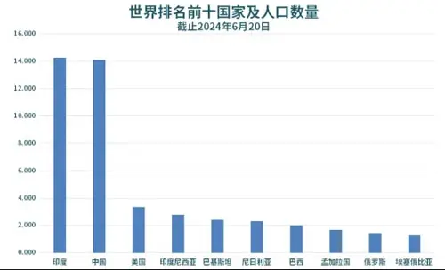
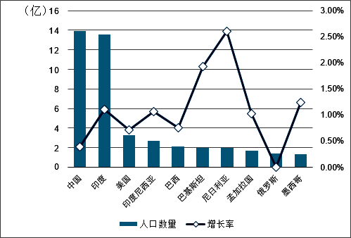

# React + Vite

This template provides a minimal setup to get React working in Vite with HMR and some ESLint rules.

Currently, two official plugins are available:

- [@vitejs/plugin-react](https://github.com/vitejs/vite-plugin-react/blob/main/packages/plugin-react/README.md) uses [Babel](https://babeljs.io/) for Fast Refresh
- [@vitejs/plugin-react-swc](https://github.com/vitejs/vite-plugin-react-swc) uses [SWC](https://swc.rs/) for Fast Refresh

# 安装环境
Mac 终端Terminal
Node.js  git
1.	**自动配置环境变量**：  
https://nodejs.org/zh-cn/download 
   Node.js 官方安装包（从[官网](https://nodejs.org/)下载的 `.pkg` 文件）会自动将 Node.js 和 npm 的可执行文件路径添加到系统的 `PATH` 环境变量中。  
   - 安装后打开终端（Terminal），直接输入以下命令即可验证：
     ```bash
     node -v  # 查看 Node.js 版本
     npm -v   # 查看 npm 版本
2. **安装位置**：  
   Node.js 会被安装到 `/usr/local/bin/node`，npm 在 `/usr/local/bin/npm`，而 `/usr/local/bin` 默认已在系统的 `PATH` 中。
- 安装后务必**重启终端**再测试命令。
- 遇到问题优先检查 `node` 和 `npm` 的路径是否存在：
  ```bash
  which node  # 应返回 /usr/local/bin/node
  which npm   # 应返回 /usr/local/bin/npm
  ```
 
问题: 安装node需要开机密码,开机密码是提供的吗?
Vscode下载安装
https://code.visualstudio.com/Download
插件: ES7 react 、prettier

Chrome浏览器下载: https://www.google.cn/chrome/ 
Github模版下载,什么模版BetterZip‌ 解压软件
https://github.com/wvOoOvw/React-Template 
npm create vite@latest my-vite-app

lodash中文网:
https://www.lodashjs.com/docs/lodash.chunk


moment中文网:
https://momentjs.cn/


第一面:
https://ant-design.antgroup.com/components/overview-cn 
页面开发:

数据表格 API 请求
表格 最后列操作列 可编辑表格的交换
Mock promise mockJS


拖动浏览器 响应式细节点

间距 自适应 图标 icon 设计稿上的图片 英文

模版里面 有组件库

一堆人问问题 某个模块怎么实现的
后端问:
模拟数据怎么做的 多次请求 防抖 节流

产品经理:
紧急需求 整体的安排
你有什么想我们的
之前单位做什么项目, 项目中的技术栈
Jquery、vue

# echarts
第二面:还原设计稿
图表import  echarts
https://echarts.apache.org/handbook/zh/get-started/ 
筛选模块 筛选区域 城市 时间

echarts:
https://echarts.apache.org/zh/index.html

npm install echarts --save

terminal

柱状图，饼图，横向柱状图



# 编程相关问题
做完了以后呢，两个面试官会进来，先是跟您review整个coding的思路，为什么这么写？一步一步会问的很细！！！然后在跑通的时候，也问您会不会有什么其他的更优化的想法？或者随机问您能在过往的一些项目基本上都是怎么去对接的？怎么做的开发等等？

！！！和面试官的沟通环节非常重要，要能说明白自己思路和有无其他更好的思路方案等。


# 项目经历相关问题
不会问jq和vue，只问以前你做过的项目

有什么难点，包含哪些内容

提前准备好2个难点，以及自己是怎么解决的，花了多久，最后的成果是什么

Vue 到React 的技术栈迁移

使用jquery实现一个tooltip 效果，怎么实现

或者随机问您能在过往的一些项目基本上都是怎么去对接的？怎么做的开发等等？

# 团队成员问题
- 后端开发： 
    restful接口 
    RESTful是一种网络应用程序的设计风格和开发方式，它基于HTTP协议，并支持使用XML或JSON格式进行数据定义

    防抖（Debounce）: 确保连续触事件仅执行最后一次操作,事件停止触发后延迟执行,事件停止触发后延迟执行
    
    防抖函数
    ```js 
    function debounce(func, delay) {
        let timer;
        return function(...args) {
            clearTimeout(timer); 
            timer = setTimeout(() => {
                func.apply(this, args);
            }, delay);
        };  
    }
    
    ```
    使用示例：
    ```js
        const searchInput = document.getElementById('search');
        const fetchData = debounce(() => {
        console.log('发送搜索请求');
        }, 500);
        searchInput.addEventListener('input', fetchData); // 停止输入500ms后执行

    ```

    ‌防抖适用场景‌
    ‌1. 输入框实时搜索‌: 用户停止输入后延迟发送请求，减少无效请求（如搜索框联想词）
    ‌2. 窗口大小调整（resize）, 窗口停止调整后更新布局，避免频繁重绘
    ‌3. 表单验证‌,用户停止输入后校验格式（如密码强度检测）


    节流(Throttle): 限制函数执行频率，避免高频调用, 固定时间间隔内仅执行一次，无视中间触发
    节流函数
    ```js
    function throttle(func, interval) {
        let lastTime = 0;
        return function(...args) {
            const now = Date.now();
            if (now - lastTime >= interval) {
                func.apply(this, args);
                lastTime = now;
            }
        };
    }

    ```

    使用实例
    ```js
    window.addEventListener('scroll', throttle(() => {
        console.log('处理滚动事件');
    }, 200)); // 每200ms最多触发一次

    ```
    ‌节流适用场景‌
    ‌1. 页面滚动事件（scroll）‌, 固定间隔触发回调（如无限滚动加载）
    ‌2. 高频点击按钮‌, 防止重复提交（如支付按钮）
    ‌3. 动画渲染‌ 控制渲染帧率（如元素跟随鼠标移动）


- 产品经理：

# 前端面试自我介绍
开场白：
面试官好，感谢贵公司给我这个机会来参加面试，我叫胡慧慧，18年毕业，学历本科，计算机科学与技术专业。7年的前端开发经验，其中有3年外企相关工作经验。主要的技术栈react,那么我前端方面的学习呢，是从大学的时候开始的，一本锋利的Jquery和Bootstrap框架开启前端开发的道路；在工作的实际项目中遇到很多问题，也不断地炼自己(展开)，到现在也有自己解决问题的一套方案。

上海埃林哲ERP咨询及实施服务经验,业务范围涵盖ERP、业务中台、CRM、SRM、MES、零售系统、供应链管理系统、数据分析等信息科技服务,目前已服务了近1000家的大中型集团客户,为企业提供服务涵盖转型过程的战略部署,业务梳理与规划,落地工具,价值创造等全链条,做可落地的数字化,有效果的数字化.

熟悉的技术：


上海华钦
专注于金融行业信息技术服务，包括银行核心系统开发与维护、保险信息化解决方案、金融科技产品研发等

总结：

作为一名丰富工作经验的前端开发工程师，我具备扎实的技术功底、良好的沟通能力和团队协作精神，
同时也具备较强的学习能力和适应能力。我相信只要给我一个机会，我就能够迅速融入贵公司的团队，并且为公司创造更多的价值。
再次感谢贵公司给我这次面试机会，非常期待能够成为贵公司的一员。


