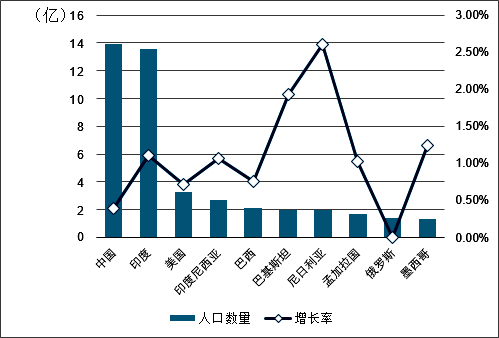
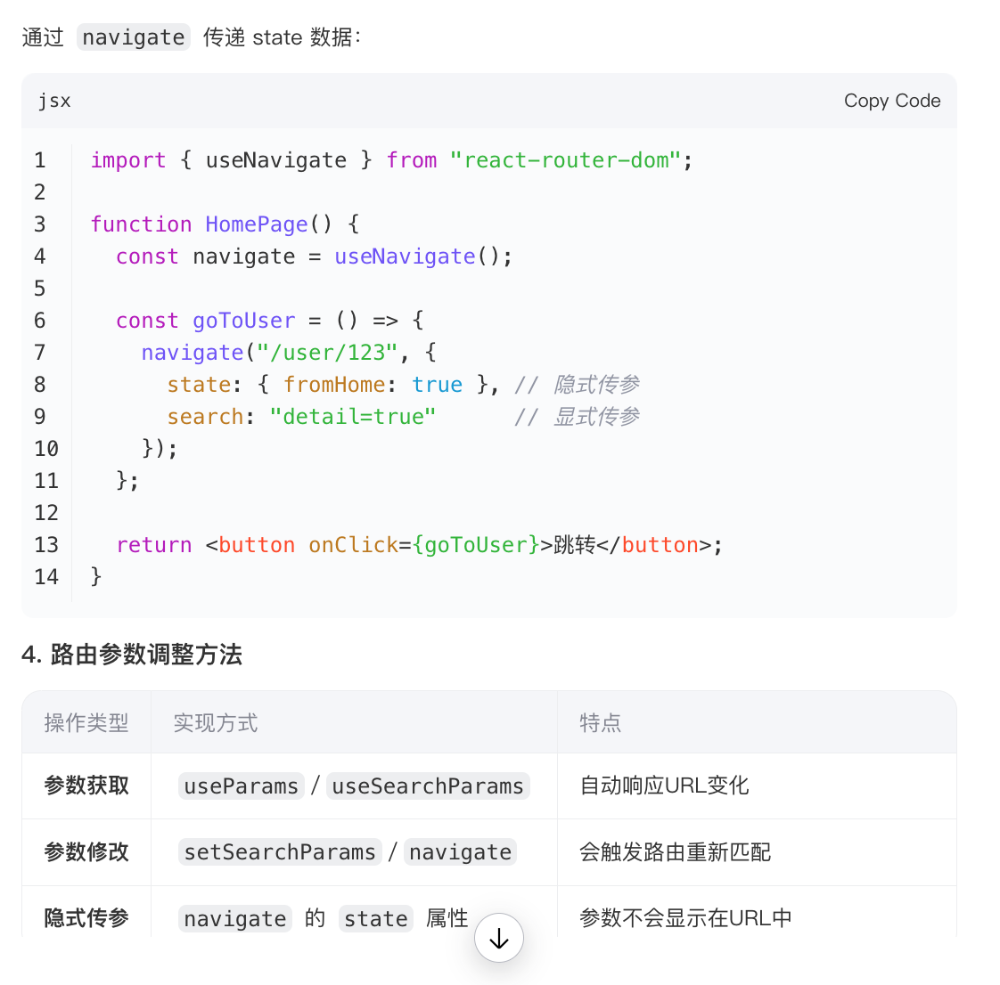

# React + Vite

This template provides a minimal setup to get React working in Vite with HMR and some ESLint rules.

Currently, two official plugins are available:

- [@vitejs/plugin-react](https://github.com/vitejs/vite-plugin-react/blob/main/packages/plugin-react/README.md) uses [Babel](https://babeljs.io/) for Fast Refresh
- [@vitejs/plugin-react-swc](https://github.com/vitejs/vite-plugin-react-swc) uses [SWC](https://swc.rs/) for Fast Refresh

# 安装环境
Mac 终端Terminal
Node.js  git
1.	**自动配置环境变量**：  
https://nodejs.org/zh-cn/download 
   Node.js 官方安装包（从[官网](https://nodejs.org/)下载的 `.pkg` 文件）会自动将 Node.js 和 npm 的可执行文件路径添加到系统的 `PATH` 环境变量中。  
   - 安装后打开终端（Terminal），直接输入以下命令即可验证：
     ```bash
     node -v  # 查看 Node.js 版本
     npm -v   # 查看 npm 版本
2. **安装位置**：  
   Node.js 会被安装到 `/usr/local/bin/node`，npm 在 `/usr/local/bin/npm`，而 `/usr/local/bin` 默认已在系统的 `PATH` 中。
- 安装后务必**重启终端**再测试命令。
- 遇到问题优先检查 `node` 和 `npm` 的路径是否存在：
  ```bash
  which node  # 应返回 /usr/local/bin/node
  which npm   # 应返回 /usr/local/bin/npm
  ```
 
问题: 安装node需要开机密码,开机密码是提供的吗?
Vscode下载安装
https://code.visualstudio.com/Download
插件: ES7 react 、prettier

Chrome浏览器下载: https://www.google.cn/chrome/ 
Github模版下载,什么模版BetterZip‌ 解压软件
https://github.com/wvOoOvw/React-Template 
npm create vite@latest my-vite-app

deepseek:
https://chat.deepseek.com/ 

lodash中文网:
https://www.lodashjs.com/docs/lodash.chunk


moment中文网:
https://momentjs.cn/


第一面:
https://ant-design.antgroup.com/components/overview-cn 
页面开发:

数据表格 API 请求
表格 最后列操作列 可编辑表格的交换
Mock promise mockJS


拖动浏览器 响应式细节点

间距 自适应 图标 icon 设计稿上的图片 英文

模版里面 有组件库

一堆人问问题 某个模块怎么实现的
后端问:
模拟数据怎么做的 多次请求 防抖 节流

产品经理:
紧急需求 整体的安排
你有什么想我们的
之前单位做什么项目, 项目中的技术栈
Jquery、vue

# echarts
第二面:还原设计稿
图表import  echarts
https://echarts.apache.org/handbook/zh/get-started/ 
筛选模块 筛选区域 城市 时间

echarts:
https://echarts.apache.org/zh/index.html

npm install echarts --save

terminal

柱状图，饼图，横向柱状图



# 编程相关问题
做完了以后呢，两个面试官会进来，先是跟您review整个coding的思路，为什么这么写？一步一步会问的很细！！！然后在跑通的时候，也问您会不会有什么其他的更优化的想法？或者随机问您能在过往的一些项目基本上都是怎么去对接的？怎么做的开发等等？

！！！和面试官的沟通环节非常重要，要能说明白自己思路和有无其他更好的思路方案等。


# 项目经历相关问题
不会问jq和vue，只问以前你做过的项目

有什么难点，包含哪些内容

提前准备好2个难点，以及自己是怎么解决的，花了多久，最后的成果是什么
1. &zwnj;**难点定位**&zwnj;：技术场景 + 问题严重性（数据量化）  
2. &zwnj;**解决过程**&zwnj;：关键技术方案 + 时间分配（分阶段说明）  
3. &zwnj;**成果验证**&zwnj;：性能/体验提升指标 + 业务价值 

难点一：复杂状态管理导致页面性能下降
问题描述：
在开发一个动态表单页面时（比如人才信息, 基本信息、教育经历、工作经历、项目经历），表单字段之间存在联动逻辑（如选择A选项后，B字段才显示）。
初期使用React的Context + useState管理状态，但随着表单复杂度增加，页面出现明显卡顿，交互延迟严重。

解决过程：

定位问题（半天）：

使用React DevTools的Profiler发现，每次输入都会触发整个表单的重新渲染。

控制台日志显示，深层嵌套的组件因Context变化全部更新。

优化方案（2天）：

拆分Context：将全局表单状态拆分为多个独立Context（如FormConfigContext、FormDataContext），减少不必要的渲染。

<!-- 引入状态管理库：评估后选用Zustand（轻量级），利用其选择器（selectors）优化组件订阅逻辑。 -->

备忘录（memo）优化：对纯展示组件应用React.memo，避免重复渲染。

成果：

输入延迟从500ms降至50ms以下，表单流畅度显著提升。

代码可维护性增强，后续新增联动逻辑时开发效率提高30%。

难点二: 路由设计不合理导致页面多次请求api性能问题
问题描述: 在开发workflow list与详情业务时, 没有设计单页面对于单路由, list和详情页面对应统一路由,
页面一刷新就回到list, 用户友好体验很不好, 页面的参数传递极其繁琐, 有些api进入详情页面的时候调用是最好的时机,但是因为路由的原因需要手动在打开详情页时再次调用
路由映射机制

技术选型react-router-dom, 选createBrowserRouter, 数据驱动路由，支持与数据加载深度集成
‌隐式传参‌	navigate 的 state 属性	参数不会显示在URL中


优化方案:

list 详情分别有自己的路由, 隐式传参‌	navigate 的 state 属性	参数不会显示在URL中


## Vue 到React 的技术栈迁移？


使用jquery实现一个tooltip 效果，怎么实现

## 或者随机问您能在过往的一些项目基本上都是怎么去对接的？怎么做的开发等等？

**协作流程（沟通）+ 技术能力（工程化思维）**

工程能力，又证明你能用技术驱动业务

需求对接-开发-测试-上线
1. 项目对接流程
（ 需求确认阶段

    跨部门协作：与产品经理、UI/UX、后端进行需求评审，明确：
    1. 产品需求：产品经理了解业务背景、业务目标、关键流程，BA提供需求文档

    2. 产品原型和交互细节（使用Figma/Sketch/蓝湖）UI

    3. 接口规范（接口设计、数据格式、Mock数据）后端
        接口对接、约定好可以先行开发
        联调策略：后端提供Swagger文档，明确请求方式、入参、出参，前端使用MockJ模拟数据本地开发
        异常处理：明确错误码规范，定义状态字段，错误信息error_message，成功信息、数据data字段

    4. 技术边界（如分页上限、最大额度、埋点方案、性能指标）前端

    案例：

    "在商城项目中，我们通过Swagger文档与后端对齐接口字段，提前发现‘商品SKU嵌套结构’的复杂度，最终协商改为扁平化数据结构，减少前端遍历逻辑。"

2. 开发实施阶段

    **技术方案设计**

    技术选型：根据团队技术栈（如React/Vue版本）和项目规模选择工具：
    
    案例：
    中后台项目选用
    用户管理 增删改查 分配角色<br/>
      角色管理 增删改查 分配菜单和权限<br/>
      权限管理 增删改查<br/>
      菜单管理 增删改查<br/>
     - 突出 **业务价值**：基础模块（用户管理、角色管理、权限管理、菜单管理），抽离使新项目开发效率提升20%

    选用Vite+React+Ant Design， 通过动态导入（懒加载）将首屏体积减少40%。
    - 展示 **技术深度**：例：“选择Vite因ESM原生加载快于Webpack，HMR速度提升70%”  

    状态管理（Redux/Pinia/Zustand）

    构建工具（Vite/Webpack）

    跨端方案（如Taro/Uniapp）

    **工程化规范**

    代码管理：Git Flow + 分支策略（feat/xxx、fix/xxx）

    协作工具：Jira/禅道管理任务，每日站会同步阻塞点

    代码质量：ESLint/Prettier + Husky预提交检查，SonarQube扫描

    **开发规范**  
    - 代码：组件按`Atomic Design`划分，API请求层封装（Axios拦截器）  
    - 状态：Vuex/Pinia模块化，区分全局状态（用户信息）与局部状态（组件内）  
    - 样式：SCSS变量集中管理，BEM命名规范，UI库按需引入（如Element Plus）


3. 典型问题应对策略
    1. **需求变更**  
    - 评估影响范围，推动产品更新PRD文档，必要时拆分迭代版本。

    2. **性能瓶颈**  
    - 方案：  
        - 首屏：SSR/静态化（Nuxt.js）  
        - 长列表：虚拟滚动（vue-virtual-scroller） 
            渲染优化：

            "在长列表场景下，使用虚拟滚动（react-window）将FPS从15提升到55+" 
        - 包体积：代码分割（dynamic import）、分析Bundle（webpack-bundle-analyzer）

    3. **跨端兼容**  
    - 移动端：PostCSS自动补全前缀，VW适配+媒体查询  
    - 桌面端：Electron通信层隔离（preload.js）

4. 项目复盘与总结
    项目复盘：记录技术债务，表单字段超过100+时，输入卡顿
    组件复用：抽离公共组件到组件库，为公司其他项目提供支持
    编写接口Mock平台，前端不依赖后端环境，有后端api文档的可以先行模拟数据独立开发，将联调周期缩短30%

    推动后端使用GraphQL聚合接口，减少请求次数  
> - 制定《前端异常监控手册》，线上错误率下降65%”

# 团队成员问题
- 后端开发： 
    restful接口 
    RESTful是一种网络应用程序的设计风格和开发方式，它基于HTTP协议，并支持使用XML或JSON格式进行数据定义

    防抖（Debounce）: 确保连续触事件仅执行最后一次操作,事件停止触发后延迟执行,事件停止触发后延迟执行
    
    防抖函数
    ```js 
    function debounce(func, delay) {
        let timer;
        return function(...args) {
            clearTimeout(timer); 
            timer = setTimeout(() => {
                func.apply(this, args);
            }, delay);
        };  
    }
    
    ```
    使用示例：
    ```js
        const searchInput = document.getElementById('search');
        const fetchData = debounce(() => {
        console.log('发送搜索请求');
        }, 500);
        searchInput.addEventListener('input', fetchData); // 停止输入500ms后执行

    ```

    ‌防抖适用场景‌
    ‌1. 输入框实时搜索‌: 用户停止输入后延迟发送请求，减少无效请求（如搜索框联想词）
    ‌2. 窗口大小调整（resize）, 窗口停止调整后更新布局，避免频繁重绘
    ‌3. 表单验证‌,用户停止输入后校验格式（如密码强度检测）


    节流(Throttle): 限制函数执行频率，避免高频调用, 固定时间间隔内仅执行一次，无视中间触发
    节流函数
    ```js
    function throttle(func, interval) {
        let lastTime = 0;
        return function(...args) {
            const now = Date.now();
            if (now - lastTime >= interval) {
                func.apply(this, args);
                lastTime = now;
            }
        };
    }

    ```

    使用实例
    ```js
    window.addEventListener('scroll', throttle(() => {
        console.log('处理滚动事件');
    }, 200)); // 每200ms最多触发一次

    ```
    ‌节流适用场景‌
    ‌1. 页面滚动事件（scroll）‌, 固定间隔触发回调（如无限滚动加载）
    ‌2. 高频点击按钮‌, 防止重复提交（如支付按钮）
    ‌3. 动画渲染‌ 控制渲染帧率（如元素跟随鼠标移动）


- 产品经理：

# 前端面试自我介绍
开场白：
面试官好，感谢贵公司给我这个机会来参加面试，我叫胡慧慧，18年毕业，学历本科，计算机科学与技术专业。7年的前端开发经验，其中有3年外企相关工作经验。主要的技术栈react,那么我前端方面的学习呢，是从大学的时候开始的，锋利的Jquery和Bootstrap框架、毕业设计做的微商城小程序，工作中使用react+redux+webpack/vite+antd技术栈做过NetSuite业务中台系统、CRM、零售系统、供应链管理系统等标准后台管理系统以及toB端订货商城, 同时也做过加盟商订货/商城APP, 使用的技术栈是react-native+antd-mobile-rn+dva, 也有主流框架vue的开发经验, 项目是资金管理系统, 使用vue的版本是vue2+vuex+element-plus. 在工作的实际项目积累了很多经验，产品迭代, 业务团队的协作, 业务需求的理解, 前端工程化、性能优化, 也不断地炼自己，到现在也有自己解决问题的一套方案。最近的一个项目是SOSU机器学习平台, 主要做的是数据挖掘与分析 以及模型训练，为金融机构挖掘和分析数据，提供 IT 解决方案.

总结：

作为一名丰富工作经验的前端开发工程师，我具备扎实的技术功底、良好的沟通能力和团队协作精神，
同时也具备较强的学习能力和适应能力。我相信只要给我一个机会，我就能够迅速融入贵公司的团队，并且为公司创造更多的价值。
再次感谢贵公司给我这次面试机会，非常期待能够成为贵公司的一员。谢谢.

上海埃林哲ERP咨询及实施服务经验,业务范围涵盖ERP、业务中台、CRM、SRM、MES、零售系统、供应链管理系统、数据分析等信息科技服务,目前已服务了近1000家的大中型集团客户,为企业提供服务涵盖转型过程的战略部署,业务梳理与规划,落地工具,价值创造等全链条,做可落地的数字化,有效果的数字化.

上海华钦
专注于金融行业信息技术服务，包括银行核心系统开发与维护、保险信息化解决方案、金融科技产品研发等


